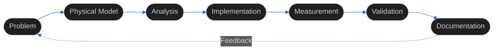

<!-- ============================================================
     TA1RJV · GITHUB PROFILE README
     RF ENGINEERING · SDR · DSP · DIGITAL COMMUNICATIONS
     ============================================================ -->

<div align="center">


<a href="https://github.com/ta1rjv">
  
</a>

<br/>

<a href="https://github.com/ta1rjv">
  
</a>
<a href="https://www.qrz.com/db/TA1RJV">
  
</a>


</div>

---

## About

I am an amateur radio operator and RF-focused engineer working across **radio-frequency systems, software-defined radio, digital communications, signal processing, embedded Linux and experimental communication technologies**.

My work is centered on the boundary between **physical systems and software**. I am interested not only in whether a system works, but in understanding the complete signal path:

> **Generate → Process → Transmit → Propagate → Receive → Measure → Interpret**

This means treating RF hardware, DSP, software, antennas, propagation, embedded platforms and instrumentation as interconnected parts of one engineering problem.

<div align="center">

`theory` → `circuit` → `code` → `air` → `measurement` → `validation`

</div>

---

## Engineering Scope

<table>
<tr>
<td width="33%" valign="top">

### RF Engineering

RF front-ends, microwave systems, impedance matching, filters, amplifiers, frequency conversion, transmission lines, antennas and measurement.

</td>

<td width="33%" valign="top">

### Software Defined Radio

SDR architectures, IQ processing, DSP, modulation, signal generation, receiver chains and software-controlled RF systems.

</td>

<td width="33%" valign="top">

### Digital Communications

Weak-signal communication, synchronization, modulation, coding, bandwidth efficiency and practical digital transmission systems.

</td>
</tr>

<tr>
<td width="33%" valign="top">

### Embedded Systems

Embedded Linux, Raspberry Pi platforms, hardware interfaces, networking, automation and software-defined electronics.

</td>

<td width="33%" valign="top">

### Propagation & Antennas

Line-of-sight analysis, Fresnel zones, atmospheric effects, rain scatter, meteor scatter, EME and microwave propagation.

</td>

<td width="33%" valign="top">

### Engineering Software

Technical web applications, visualization, simulation utilities, measurement tools and interfaces connecting software with RF systems.

</td>
</tr>
</table>

---

## Technical Stack

<div align="center">


<br/><br/>


</div>

---

## Engineering Method

I approach technical problems from the **system level first**.

The objective is not merely to obtain a working result, but to understand:

* which assumptions produced the result,
* which physical mechanism is responsible,
* where the model is valid,
* where measurement uncertainty enters,
* and whether the result can be independently reproduced.



<div align="center">

|     Simulation     |   Documentation  |      Measurement      |
| :----------------: | :--------------: | :-------------------: |
| What should happen | What is expected | What actually happens |

</div>

The difference between these three is often where the interesting engineering problems begin.

---

## Research & Development Themes

<table>
<tr>
<td width="50%" valign="top">

### RF & Microwave

* RF front-end design
* Amplification and gain staging
* Filtering and frequency conversion
* Impedance matching
* Transmission-line behaviour
* Microwave systems
* Practical RF measurement

### SDR & DSP

* SDR architectures
* IQ signal processing
* Digital modulation
* Signal generation and analysis
* Receiver and transmitter chains
* Software-controlled RF

### Digital Communications

* Weak-signal systems
* Synchronization
* Digital modes
* Coding and bandwidth efficiency
* Experimental communication protocols

### Propagation

* Rain scatter
* Meteor scatter
* EME
* Line-of-sight analysis
* Fresnel clearance
* Atmospheric propagation

</td>

<td width="50%" valign="top">

### Antennas

* Practical antenna systems
* RF matching
* Antenna behaviour
* System-level performance

### Embedded & Linux

* Embedded Linux
* Raspberry Pi systems
* Networking
* Hardware interfaces
* Automation
* RF control platforms

### Engineering Software

* RF-oriented web applications
* Visualization
* Measurement interfaces
* Propagation utilities
* Geographic data processing
* Simulation and analysis tools

### Experimental Systems

* Reverse engineering
* Undocumented hardware
* Measurement-driven characterization
* Test automation
* Reproducible experimentation

</td>
</tr>
</table>

---

## R&D Philosophy

A recurring theme in my work is turning **technically incomplete information** into systems that can be **understood, tested and reproduced**.

```text
Documentation
      +
Physical reasoning
      +
Experimentation
      +
Measurement
      +
Software
      ↓
Reproducible engineering knowledge
```

The interesting part is often not the component itself, but the interaction between the components.

A datasheet may describe the expected behaviour.

A simulation may describe the theoretical behaviour.

A measurement reveals the behaviour of the actual hardware.

The engineering problem is understanding the difference.

---

## Open Source & Amateur Radio

I use GitHub to document and develop **engineering tools, experimental software, research projects and communication systems**.

My amateur-radio work provides a practical environment where several disciplines converge:

<div align="center">


</div>

I operate under the callsign **TA1RJV**.

---

## Engineering Principles

<table>
<tr>
<td align="center" width="33%">

### Measurable

Prefer quantitative evidence over purely qualitative conclusions.

</td>

<td align="center" width="33%">

### Reproducible

Results should not depend on undocumented assumptions.

</td>

<td align="center" width="33%">

### Physically Consistent

Models should remain compatible with the underlying physical system.

</td>
</tr>

<tr>
<td align="center">

### Explicit Uncertainty

Unknowns, tolerances and measurement limitations should be visible.

</td>

<td align="center">

### Documented

Knowledge should remain accessible beyond the original experiment.

</td>

<td align="center">

### Verifiable

Claims should be testable against evidence.

</td>
</tr>
</table>

> **The objective is not simply to make a system work — it is to understand why it works, when it works, when it fails, and how the result can be reproduced.**

---

## GitHub Activity

<div align="center">


<br/><br/>


<br/><br/>


<br/><br/>


</div>

---

## 3D Contribution Graph

<div align="center">


<sub>Automatically generated contribution visualization.</sub>

</div>

---

## Contribution Snake

<div align="center">


<sub>Contribution activity rendered as a generated SVG.</sub>

</div>

---

## Current Technical Focus

<div align="center">

`RF Systems` · `SDR` · `DSP` · `Digital Communications` · `Propagation` · `Microwave` · `Embedded Linux` · `Engineering Software` · `Open Source`

</div>

---

## Contact

<div align="center">

<a href="https://github.com/ta1rjv">
  
</a>

<a href="https://www.qrz.com/db/TA1RJV">
  
</a>

<br/><br/>

### `Build · Measure · Understand · Document`

<br/>

<sub>73 de <strong>TA1RJV</strong> · See you on the bands.</sub>

</div>


